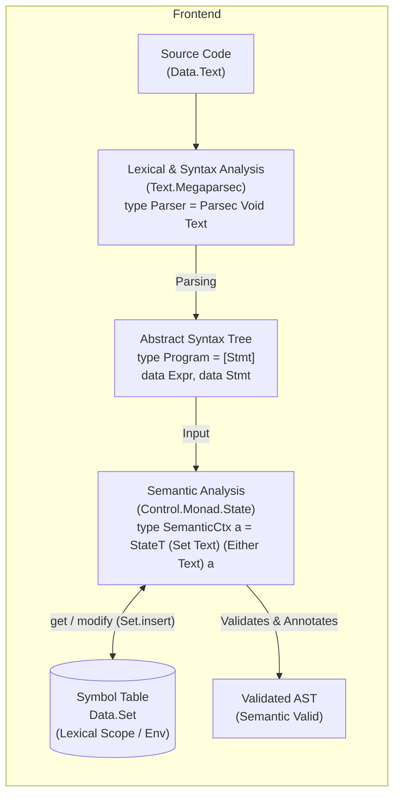

# DWH COMPILER

```mermaid
flowchart TD
    subgraph Frontend ["Frontend"]
        direction TB
        Source["Source Code\n(Data.Text)"] --> LexerParser
        
        LexerParser["Lexical & Syntax Analysis\n(Text.Megaparsec)\ntype Parser = Parsec Void Text"] 
        LexerParser -- "Parsing" --> AST
        
        AST["Abstract Syntax Tree\ntype Program = [Stmt]\ndata Expr, data Stmt"]
        AST -- "Input" --> Semantic
        
        Semantic["Semantic Analysis\n(Control.Monad.State)\ntype SemanticCtx a = StateT (Set Text) (Either Text) a"]
        
        SymbolTable[("Symbol Table\nData.Set\n(Lexical Scope / Env)")]
        Semantic <-->|"get / modify (Set.insert)"| SymbolTable
        
        Semantic -- "Validates & Annotates" --> ValidatedAST["Validated AST\n(Semantic Valid)"]
    end
```